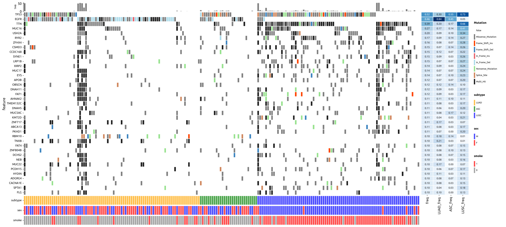

# pymaftools

`pymaftools` is a Python package designed to handle and analyze MAF (Mutation Annotation Format) files. It provides utilities for working with mutation data, including the `MAF` and `PivotTable` classes for data manipulation, and functions for visualizing mutation data with oncoplots.


## Features

- **MAF Class**: A utility to load, parse, and manipulate MAF files.
- **PivotTable Class**: A custom pivot table implementation for summarizing mutation frequencies and sorting genes and samples.
- **Oncoplot**: Generate oncoplot visualizations with mutation data and frequencies.
- **LollipopPlot**: Visualize mutation positions along protein sequences with optional domain annotation.
- **Boxplot with Statistical Testing**: Generate comparative boxplots with integrated statistical tests (e.g., Wilcoxon, t-test) for group-wise mutation metrics.
- **Similarity Metrics**: Compute similarity between samples or cohorts based on mutation profiles (e.g., Jaccard index, cosine similarity).

## Requirements

`pymaftools` requires Python 3.10 or higher and the following dependencies:

### Core Dependencies

- **pandas** (>2.0) - Data manipulation and analysis
- **numpy** - Numerical computing
- **matplotlib** - Basic plotting and visualization
- **seaborn** - Statistical data visualization
- **scipy** - Scientific computing and statistics
- **networkx** - Graph algorithms and network analysis
- **scikit-learn** - Machine learning algorithms
- **statsmodels** - Statistical modeling and hypothesis testing
- **statannotations** - Statistical annotations for plots
- **requests** - HTTP library for API calls
- **beautifulsoup4** - HTML/XML parsing
- **tqdm** - Progress bars

All dependencies will be automatically installed when you install `pymaftools` using pip or conda.

## Installation

### Create a Conda Environment

```bash
conda create -n pymaftools python=3.10
```

### Using GitHub (for the latest version) ✅ **Recommended**

To install directly from GitHub (if you want the latest changes):

```bash
pip install git+https://github.com/xu62u4u6/pymaftools.git
```

### Using pip (from PyPI)

You can install the stable version `pymaftools` package directly from PyPI using pip:

```bash
pip install pymaftools
```


## Usage

### Importing the Package

```python
from pymaftools import *
```

### Getting Started

```python
# Load MAF files
maf_case1 = MAF.read_maf("case1.maf")
maf_case2 = MAF.read_maf("case2.maf")
all_case_maf = MAF.merge_mafs([maf_case1, maf_case2])

# if no sample_ID column in MAF file, add it
all_case_maf["sample_ID"] = all_case_maf["tumor_sample_barcode"] 

# Filter to keep only nonsynonymous mutations
filtered_all_case_maf = all_case_maf.filter_maf(MAF.nonsynonymous_types)

# Convert to pivot table (features x samples table, mutation classification as values)
pivot_table = filtered_all_case_maf.to_pivot_table()

# Inspect PivotTable structure
print(pivot_table)                        # check pivot table
print(pivot_table.feature_metadata)       # check feature metadata (genes/mutations)
print(pivot_table.sample_metadata)        # check sample metadata

# Process and sort the pivot table
sorted_pivot_table = (pivot_table
                    .add_freq()                     # Calculate mutation frequencies
                    .sort_features(by="freq")       # Sort features by frequency
                    .sort_samples_by_mutations()    # Sort samples by mutation patterns
                    .calculate_TMB(capture_size=50) # Calculate tumor mutation burden
                    )

# Create basic oncoplot using method chaining
oncoplot = (OncoPlot(sorted_pivot_table.head(50))
            .set_config(figsize=(15, 10), 
                       width_ratios=[20, 2, 2])  # heatmap, frequency bar, classification bar
            .mutation_heatmap()
            .plot_freq()
            .plot_bar()
            .save("oncoplot.png", dpi=300)
            )
```

### Create Mutation Oncoplot with Sample Metadata

```python
# Load and process data
LUAD_maf = MAF.read_csv("data/WES/LUAD_all_case_maf.csv")
LUSC_maf = MAF.read_csv("data/WES/LUSC_all_case_maf.csv")
all_case_maf = MAF.merge_mafs([LUAD_maf, LUSC_maf])

# Filter maf and convert to table
freq = 0.1
table = (all_case_maf
         .filter_maf(all_case_maf.nonsynonymous_types)
         .to_pivot_table()
         )

# load sample metadata
all_sample_metadata = pd.read_csv("data/all_sample_metadata.csv")

# get case_ID (case1_T -> case1, T) and concat sample_metadata using case_ID 
table.sample_metadata[["case_ID", "sample_type"]] = table.columns.to_series().str.rsplit("_", n=1).apply(pd.Series)
table.sample_metadata = pd.merge(table.sample_metadata.reset_index(), 
                                 all_sample_metadata, 
                                 left_on="case_ID",
                                 right_on="case_ID", 
                                 ).set_index(["sample_ID"])

# Add frequency calculations for different groups
table = table.add_freq(
    groups={"LUAD": table.subset(samples=table.sample_metadata.subtype == "LUAD"),
           "ASC": table.subset(samples=table.sample_metadata.subtype == "ASC"),
           "LUSC": table.subset(samples=table.sample_metadata.subtype == "LUSC")}
)

# Filter and sort table
table = (table.filter_by_freq(freq)
         .sort_features(by="freq")
         .sort_samples_by_group(group_col="subtype", 
                               group_order=["LUAD", "ASC", "LUSC"], top=10)   
        )

# Setup color mappings
categorical_columns = ["subtype", "sex", "smoke"]
cmap_dict = {key: cm.get_cmap(key, alpha=0.7) for key in categorical_columns}

# Create oncoplot with method chaining
oncoplot = (OncoPlot(table)
            .set_config(categorical_columns=categorical_columns,
                       figsize=(30, 14),
                       width_ratios=[25, 3, 0, 2]) # main heatmap, freq heatmap, flexible region, legend region 
            .mutation_heatmap() #
            .plot_freq(freq_columns=["freq", "LUAD_freq", "ASC_freq", "LUSC_freq"])
            .plot_bar()
            .plot_categorical_metadata(cmap_dict=cmap_dict) # or like {"subtype": {"LUAD": orange, "ASC": green, "LUSC": blue}, }
            .plot_all_legends() 
            .save("mutation_oncoplot.tiff", dpi=300)
            )
```


### Create Numeric CNV Oncoplot

```python
# Create numeric heatmap for CNV data using method chaining
categorical_columns = ["subtype", "sex", "smoke"]
cmap_dict = {key: cm.get_cmap(key, alpha=0.7) for key in categorical_columns}

oncoplot = (OncoPlot(CNV_gene_cosmic)
            .set_config(categorical_columns=categorical_columns,
                       figsize=(30, 10),
                       width_ratios=[25, 1, 0, 3]) # main heatmap, freq heatmap, flexible region, legend region 
            .numeric_heatmap(yticklabels=False, 
                           cmap="coolwarm",
                           vmin=-2, vmax=2)
            .plot_bar()
            .plot_categorical_metadata(cmap_dict=cmap_dict)
            .plot_all_legends() 
            .save("cnv_oncoplot.tiff", dpi=600)
            )
```


### Create Lolipop plot

```python
# read MAF file
maf = MAF.read_csv(YOUR_MAF_PATH)
gene = "EGFR" # gene name
AA_length, mutations_data = maf.get_protein_info(gene) # get protein length and mutations data
domains_data, refseq_ID = MAF.get_domain_info(gene, AA_length) # search domain data match protein length

# create LollipopPlot object
plot = LollipopPlot(
        protein_name=gene,
        protein_length=AA_length,
        domains=domains_data,
        mutations=mutations_data
    )
plot.plot()
```


## FAQ

### 1. How to adjust font sizes in OncoPlot?

You can adjust font sizes for different components using the following parameters:

```python
# Adjust y-axis gene name font size
oncoplot = OncoPlot(pivot_table, ytick_fontsize=12)

# Adjust font size in heatmaps
oncoplot.mutation_heatmap(ytick_fontsize=10)
oncoplot.numeric_heatmap(ytick_fontsize=8)

# Adjust annotation font size in frequency plot
oncoplot.plot_freq(annot_fontsize=10)
```

### 2. How to customize color mappings?

You can use the ColorManager to register and retrieve custom colors for different mutation types and categorical variables:

```python
from pymaftools.plot.ColorManager import ColorManager

# Get the color manager instance
color_manager = ColorManager()

# Register custom mutation type colors
custom_mutation_colors = {
    "Missense_Mutation": "#FF6B6B",
    "Nonsense_Mutation": "#4ECDC4", 
    "Frame_Shift_Del": "#45B7D1"
}
color_manager.register_cmap("custom_mutations", custom_mutation_colors)

# Register custom categorical colors
custom_categorical_colors = {
    "LUAD": "orange", 
    "LUSC": "blue", 
    "ASC": "green"
}
color_manager.register_cmap("subtype", custom_categorical_colors)

# Use registered colors in plots
mutation_cmap = color_manager.get_cmap("custom_mutations")
subtype_cmap = color_manager.get_cmap("subtype", alpha=0.7) # You can set alpha value here

oncoplot.mutation_heatmap(cmap_dict=mutation_cmap)
oncoplot.plot_categorical_metadata(cmap_dict={"subtype": subtype_cmap})
```

### 3. How to control visualization parameters in similarity analysis?

```python
# Control heatmap display options
result = SimilarityMatrix.analyze_similarity(
    table=table,
    method="jaccard",
    title="Similarity Analysis",
    groups=groups,
    group_order=["Group1", "Group2", "Group3"],
    layout="horizontal",  # or "grid"
    heatmap_show_only_x_ticks=True,  # Show only x-axis labels
    heatmap_annot=False,  # Don't show numeric annotations
    save_dir="./output"
)
```

### 4. How to handle performance issues with large datasets?

For large datasets, consider the following strategies:

```python
# Filter before analysis
filtered_table = (pivot_table
    .filter_by_freq(0.1)  # Keep only features with frequency > 10%
    .head(100)  # Take only top 100 features
)
# do downstream analysis on filtered_table
```

### 5. How to save and load analysis results?

Use SQLite format for saving both Cohort and PivotTable data:

```python
# Save PivotTable to SQLite
pivot_table.to_sqlite("analysis_results.db")

# Load PivotTable from SQLite
loaded_table = PivotTable.read_sqlite("analysis_results.db")

# Save Cohort to SQLite
cohort.to_sqlite("cohort_data.db")

# Load Cohort from SQLite
loaded_cohort = Cohort.read_sqlite("cohort_data.db")

# Save figures (supports multiple formats)
oncoplot.save("oncoplot.png", dpi=300)
oncoplot.save("oncoplot.tiff", dpi=300)
```

### License

This project is licensed under the MIT License - see the LICENSE file for details.

### Author

xu62u4u6
