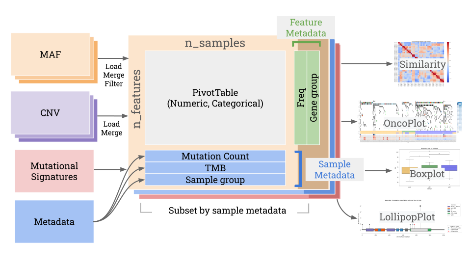
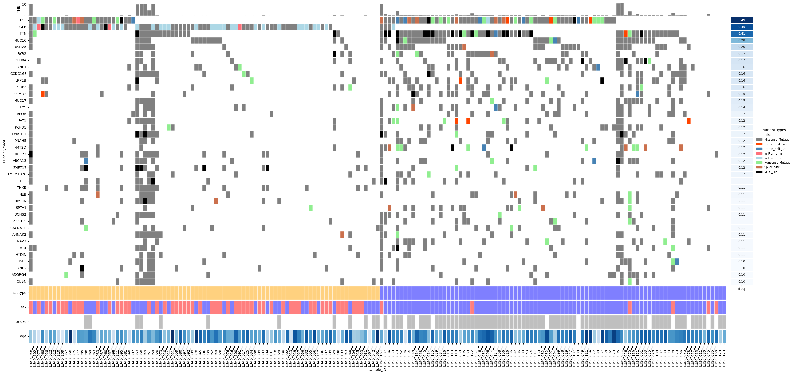
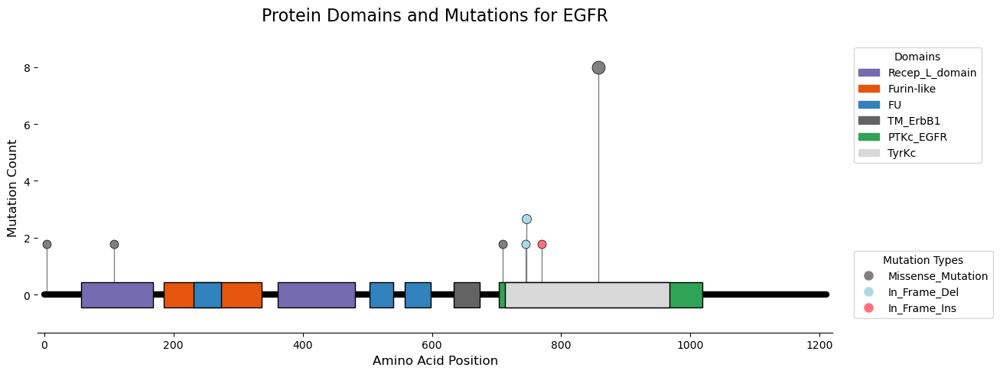

# pymaftools

`pymaftools` is a Python package designed to handle and analyze MAF (Mutation Annotation Format) files. It provides utilities for working with mutation data, including the `MAF` and `PivotTable` classes for data manipulation, and functions for visualizing mutation data with oncoplots.<BR><BR>

## Features

- **MAF Class**: A utility to load, parse, and manipulate MAF files.
- **PivotTable Class**: A custom pivot table implementation for summarizing mutation frequencies and sorting genes and samples.
- **Oncoplot**: Generate oncoplot visualizations with mutation data and frequencies.
- **LollipopPlot**: Visualize mutation positions along protein sequences with optional domain annotation.
- **Boxplot with Statistical Testing**: Generate comparative boxplots with integrated statistical tests (e.g., Wilcoxon, t-test) for group-wise mutation metrics.
- **Similarity Metrics**: Compute similarity between samples or cohorts based on mutation profiles (e.g., Jaccard index, cosine similarity).

## Installation

### Using GitHub (for the latest version) ✅ **Recommended**
To install directly from GitHub (if you want the latest changes):

```bash
pip install git+https://github.com/xu62u4u6/pymaftools.git
```

### Using pip (from PyPI)
You can install the stable version `pymaftools` package directly from PyPI using pip:

```bash
pip install pymaftools
```


## Usage

### Importing the Package

```python
from pymaftools.maf_utils import MAF, PivotTable
from pymaftools.maf_plots import create_oncoplot
```

### Getting start

```python
# Load MAF files
maf_case1 = MAF.read_maf("case1.maf")
maf_case2 = MAF.read_maf("case2.maf")
all_case_maf = MAF.merge_mafs([maf_case1, maf_case2])

# Filter to keep only nonsynonymous mutations
filtered_all_case_maf = all_case_maf.filter_maf(MAF.nonsynonymous_types)

# Convert to pivot table (genes x samples table, mutation classification as values)
pivot_table = filtered_all_case_maf.to_pivot_table()

# class PivotTable
print(pivot_table) # check pivot table
print(pivot_table.gene_metadata) # check feature metadata
print(pivot_table.sample_metadata) # check sample metadata


sorted_pivot_table = (pivot_table
                    .add_freq() # Calculate mutation frequencies
                    .sort_features_by_freq() # sort features(rows), optional
                    .sort_samples_by_mutations() # sort samples(columns), optional
                    )

# Create basic oncoplot 
oncoplot = OncoPlot(pivot_table=sorted_pivot_table.head(50), 
                    figsize=figsize, 
                    width_ratios=width_ratios)
oncoplot.heatmap()
oncoplot.plot_freq()
oncoplot.plot_bar()
oncoplot.add_xticklabel()
```
### Create oncoplot with sample metadata

```python
# load MAFs
LUAD_maf = MAF.read_csv("data/WES/LUAD_all_case_maf.csv")
LUSC_maf = MAF.read_csv("data/WES/LUSC_all_case_maf.csv")

# merge MAFs to single MAF object
all_case_maf = MAF.merge_mafs([LUAD_maf, LUSC_maf])

# Sort the pivot table (by gene frequency and sample mutation count)
pivot_table = (all_case_maf
        .filter_maf(all_case_maf.nonsynonymous_types)
        .to_pivot_table()
)

# load sample metadata
all_sample_metadata = pd.read_csv("data/all_sample_metadata.csv")

# get case_ID (case1_T -> case1, T) and concat sample_metadata using case_ID 
pivot_table.sample_metadata[["case_ID", "sample_type"]] = pivot_table.columns.to_series().str.rsplit("_", n=1).apply(pd.Series)
pivot_table.sample_metadata = pd.merge(pivot_table.sample_metadata.reset_index(), 
                                        all_sample_metadata, 
                                        left_on="case_ID",
                                        right_on="case_ID", 
                                        ).set_index(["sample_ID"])

# calculate TMB using different capture size for LUAD and LUSC
pivot_table = pivot_table.calculate_TMB(group_col="subtype", 
                                        capture_size_dict={"LUAD": 66, 
                                                           "LUSC": 50})

# sort genes by frequency and sort samples by subtypes
pivot_table = (pivot_table.add_freq()
                .sort_features_by_freq()
                .sort_samples_by_group(group_col="subtype", group_order=["LUAD", "LUSC"], top=10)
)

# categorical_columns and numeric_columns must in pivot_table.sample_metadata.columns
oncoplot = OncoPlot(pivot_table=pivot_table.head(40), # select top 40 genes
                    figsize=(40, 18),
                    width_ratios=[30, 1, 1.5],
                    categorical_columns=["subtype", "sex", "smoke"],
                    numeric_columns=["age"])
oncoplot.heatmap()
oncoplot.plot_freq()
oncoplot.plot_bar()
# assign cmap
oncoplot.plot_categorical_metadata(cmap_dict={"subtype": {"LUAD": "orange", "LUSC": "blue"}, 
                                              "smoke": {True: "gray", False: "white"},
                                              "sex": {"M": "blue", "F": "red"}}, 
                                   alpha=0.5)
oncoplot.plot_numeric_metadata()
oncoplot.add_xticklabel()

```


### Create Lolipop plot
```python
# read MAF file
maf = MAF.read_csv(YOUR_MAF_PATH)
gene = "EGFR" # gene name
AA_length, mutations_data = maf.get_protein_info(gene) # get protein length and mutations data
domains_data, refseq_ID = MAF.get_domain_info(gene, AA_length) # search domain data match protein length

# create LollipopPlot object
plot = LollipopPlot(
        protein_name=gene,
        protein_length=AA_length,
        domains=domains_data,
        mutations=mutations_data
    )
plot.plot()

```

### Requirements
Python 3.x
pandas, numpy, matplotlib, seaborn

### License
This project is licensed under the MIT License - see the LICENSE file for details.

### Author
xu62u4u6

