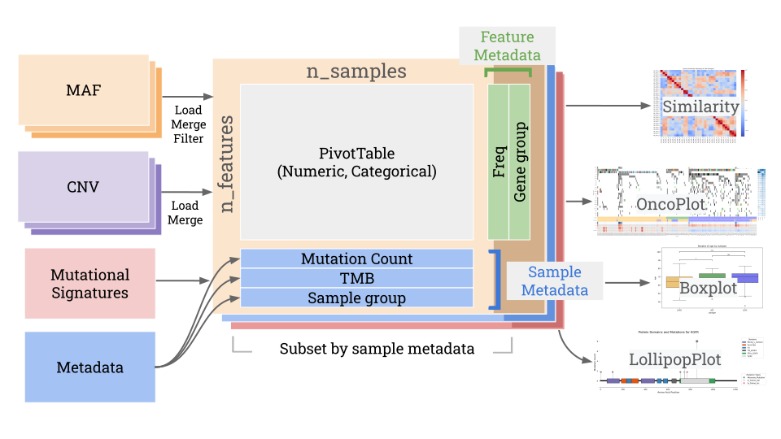
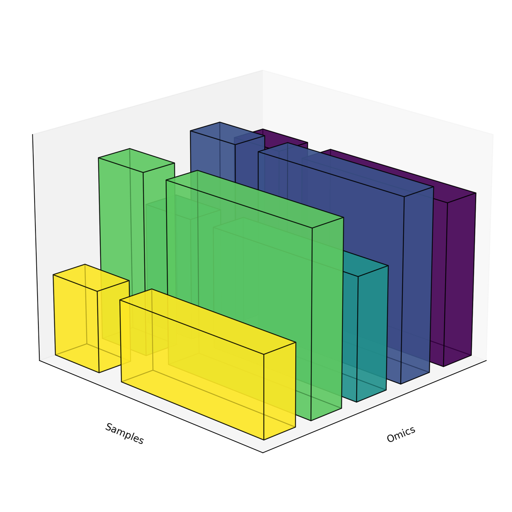
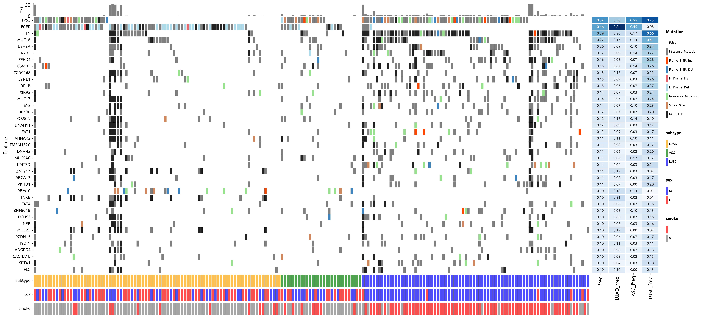
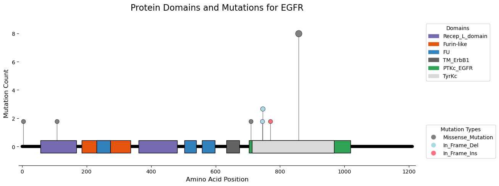

# pymaftools

[](https://dionic.xyz/pymaftools/)
[](https://pypi.org/project/pymaftools/)

`pymaftools` is a Python package for handling and analyzing MAF (Mutation Annotation Format) files and multi-omics cancer genomics data. It provides classes for data manipulation, statistical analysis, machine learning, and visualization.

<p align="center">
  
</p>
<p align="center">
  <em>pymaftools provides a unified workflow for multi-omics cancer genomics — from data loading and filtering,<br>
  through statistical analysis and machine learning, to publication-ready visualization.</em>
</p>

<p align="center">
  
</p>
<p align="center">
  <em>Multiple omics layers (SNV, CNV, expression, etc.) are integrated into a unified Cohort structure.<br>
  Each layer shares the same samples but may have different numbers of features.</em>
</p>

## Features

### Core Data Structures
- **MAF** — Load, parse, filter, and merge MAF files
- **PivotTable** — Gene/feature x sample matrix with synchronized metadata, frequency calculation, statistical testing, and filtering
- **Cohort** — Multi-omics container linking multiple PivotTables with shared sample metadata
- **CopyNumberVariationTable** — Read GISTIC arm-level and gene-level results
- **ExpressionTable** — Gene expression data with clustering support
- **SignatureTable** — COSMIC mutational signature data
- **CancerCellFractionTable** — Cancer cell fraction (CCF) data from PyClone
- **SmallVariationTable** — Specialized PivotTable for SNV/INDEL data
- **SimilarityMatrix** — Pairwise similarity analysis (Jaccard, cosine, etc.)

### Filtering & Statistical Analysis
- **filter_by_freq** — Filter features by mutation frequency
- **filter_by_variance** — Filter by variance or median absolute deviation (MAD)
- **filter_by_statistical_test** — Filter by statistical test (t-test, Mann-Whitney, Kruskal-Wallis, ANOVA) with FDR correction
- **Chi-squared / Fisher's exact test** — Association testing between features and groups
- **TMB calculation** — Tumor mutation burden per sample

### Visualization
- **OncoPlot** — Mutation landscape heatmaps with frequency bars, sample metadata, and legends
- **LollipopPlot** — Protein mutation positions with domain annotation
- **PivotTablePlot** — PCA, boxplots with statistical annotations, heatmaps (via `pt.plot`)
- **ModelPlot** — Model performance visualizations
- **MethodsPlot** — 3D methodology demonstration plots
- **ColorManager / FontManager** — Customizable color and font management

### Machine Learning
- **OmicsStackingModel** — Multi-omics stacking classifier with feature importance
- **Model utilities** — Evaluation, cross-validation, RFECV feature selection, importance heatmaps

### Utilities
- **PCA_CCA** — Dimensionality reduction utilities
- **Gene set tools** — Read GMT files, fetch MSigDB gene sets
- **Gene info** — NCBI gene ID lookup

## Requirements

Python 3.10+ with the following dependencies:

- **pandas** (>2.0), **numpy**, **matplotlib**, **seaborn**, **scipy**
- **networkx**, **scikit-learn**, **statsmodels**, **statannotations**
- **requests**, **beautifulsoup4**, **tqdm**, **tables** (HDF5)

All dependencies are automatically installed.

## Installation

### Using uv (recommended)

```bash
uv pip install pymaftools
```

### Using pip

```bash
pip install pymaftools
```

### From GitHub (latest development version)

```bash
uv pip install git+https://github.com/xu62u4u6/pymaftools.git
# or
pip install git+https://github.com/xu62u4u6/pymaftools.git
```

## Usage

### Getting Started

```python
from pymaftools import *

# Load and merge MAF files
maf1 = MAF.read_maf("case1.maf")
maf2 = MAF.read_maf("case2.maf")
merged = MAF.merge_mafs([maf1, maf2])

# Filter to nonsynonymous mutations and convert to a gene-level table
pt = merged.filter_maf(MAF.nonsynonymous_types).to_gene_table()

# Process pivot table
pt = (pt
    .add_freq()
    .sort_features(by="freq")
    .sort_samples_by_mutations()
    .calculate_tmb(default_capture_size=50)
)

# Create oncoplot. A single render() draws the figure (required before save()).
# This uses the convenience methods (mutation_heatmap/plot_freq/plot_bar), which
# are shorthand for the canonical declarative track API documented below under
# "Declarative track API" — prefer that for new code.
oncoplot = (OncoPlot(pt.head(50), figsize=(15, 10))
    .mutation_heatmap()
    .plot_freq()
    .plot_bar()
    .render()
)
oncoplot.save("oncoplot.png", dpi=300)
```

### Advanced Filtering

```python
# Filter by variance (keep top 25% most variable features)
filtered = pt.filter_by_variance(quantile=0.75, method="var")

# Filter by statistical test with FDR correction
filtered = pt.filter_by_statistical_test(
    group_col="subtype", method="kruskal", alpha=0.05
)
```

### Mutation Oncoplot with Sample Metadata

```python
# Load and process data
LUAD_maf = MAF.read_csv("data/WES/LUAD_all_case_maf.csv")
LUSC_maf = MAF.read_csv("data/WES/LUSC_all_case_maf.csv")
all_case_maf = MAF.merge_mafs([LUAD_maf, LUSC_maf])

# Filter and convert to table
table = (all_case_maf
    .filter_maf(all_case_maf.nonsynonymous_types)
    .to_gene_table()
)

# Load sample metadata
all_sample_metadata = pd.read_csv("data/all_sample_metadata.csv")
table.sample_metadata[["case_ID", "sample_type"]] = table.columns.to_series().str.rsplit("_", n=1).apply(pd.Series)
table.sample_metadata = pd.merge(
    table.sample_metadata.reset_index(), all_sample_metadata,
    left_on="case_ID", right_on="case_ID"
).set_index(["sample_ID"])

# Add group frequencies
table = table.add_freq(
    groups={"LUAD": table.subset(samples=table.sample_metadata.subtype == "LUAD"),
            "ASC": table.subset(samples=table.sample_metadata.subtype == "ASC"),
            "LUSC": table.subset(samples=table.sample_metadata.subtype == "LUSC")}
)

# Filter and sort
freq = 0.1
table = (table.filter_by_freq(freq)
    .sort_features(by="freq")
    .sort_samples_by_group(group_col="subtype",
                           group_order=["LUAD", "ASC", "LUSC"], top=10)
)

# Setup colors and create oncoplot
categorical_columns = ["subtype", "sex", "smoke"]
cmap_dict = {key: cm.get_cmap(key, alpha=0.7) for key in categorical_columns}

oncoplot = (OncoPlot(table,
                     categorical_columns=categorical_columns,
                     figsize=(30, 14))
    .mutation_heatmap()
    .plot_freq(freq_columns=["freq", "LUAD_freq", "ASC_freq", "LUSC_freq"])
    .plot_bar()
    .plot_categorical_metadata(cmap_dict=cmap_dict)
    .render()  # draws everything + all legends in one pass
)
oncoplot.save("mutation_oncoplot.tiff", dpi=300)
```


### Numeric CNV Oncoplot

```python
categorical_columns = ["subtype", "sex", "smoke"]
cmap_dict = {key: cm.get_cmap(key, alpha=0.7) for key in categorical_columns}

oncoplot = (OncoPlot(CNV_gene_cosmic,
                     categorical_columns=categorical_columns,
                     figsize=(30, 10))
    .numeric_heatmap(yticklabels=False, cmap="coolwarm", vmin=-2, vmax=2)
    .plot_bar()
    .plot_categorical_metadata(cmap_dict=cmap_dict)
    .render()
)
oncoplot.save("cnv_oncoplot.tiff", dpi=600)
```


### Declarative track API (canonical)

This is the recommended API for new code. Oncoplots are composed of *tracks*: a
main matrix plus annotation strips. The convenience methods above
(`mutation_heatmap`, `plot_freq`, `plot_bar`, `numeric_heatmap`) are legacy
shorthand that register the same tracks — `main()` covers both
`mutation_heatmap()` and `numeric_heatmap()` via `kind=`, `add_freq()` replaces
`plot_freq()`, and `add_bar()` replaces `plot_bar()`. `render()` derives the
layout and draws everything in one pass. The declarative API gives explicit
control over each track's side and, unlike the convenience methods, can draw
**feature-side annotations** (row strips from `feature_metadata`). It is reachable
from the same `table.plot` accessor as the statistical plots:

```python
op = (table.plot.oncoplot(figsize=(15, 10))
    .main()                                       # mutation matrix
    .add_bar("TMB", side="top")
    .add_freq(side="right")
    .add_sample_annotation(["subtype", "sex"], side="bottom")  # categorical
    .add_sample_annotation(["age"], side="bottom")             # numeric (+ colorbar)
    .add_feature_annotation(["pathway"], side="right")         # row-side strip
    .render(legend_width=3, wspace=0.01)          # tune layout/spacing here
)
op.save("oncoplot.png", dpi=300)
```

`add_sample_annotation` / `add_feature_annotation` infer categorical vs numeric
from the column dtype. For a continuous (CNV) main matrix use `.main(kind="cnv")`.

### Grouped oncoplot

Partition rows by a `feature_metadata` column and/or columns by a
`sample_metadata` column into labelled sections (separator lines across the
matrix + aligned tracks, with group titles). Sort first so each group is
contiguous:

```python
grouped = (table
    .sort_features(by="pathway")
    .sort_samples_by_group(group_col="subtype", group_order=["LUAD", "ASC", "LUSC"]))

op = (grouped.plot.oncoplot(figsize=(13, 9))
    .main()
    .add_bar("TMB", side="top")
    .group_features(by="pathway")   # row sections + left titles
    .group_samples(by="subtype")    # column sections + top titles
    .render()
)
op.save("grouped_oncoplot.png", dpi=300)
```

### Lollipop Plot

```python
maf = MAF.read_csv(YOUR_MAF_PATH)
gene = "EGFR"
AA_length, mutations_data = maf.get_protein_info(gene)
domains_data, refseq_ID = MAF.get_domain_info(gene, AA_length)

plot = LollipopPlot(
    protein_name=gene,
    protein_length=AA_length,
    domains=domains_data,
    mutations=mutations_data
)
plot.plot()
```



### Multi-Omics with Cohort

```python
cohort = Cohort("my_cohort")
# add_table(table, table_name) — the PivotTable comes first
cohort.add_table(mutation_pt, "mutations")
cohort.add_table(cnv_table, "cnv")
cohort.add_table(expr_table, "expression")
cohort.add_sample_metadata(clinical_df)

# Save/load
cohort.to_sqlite("cohort.db")
cohort = Cohort.read_sqlite("cohort.db")
```

### Machine Learning

```python
from pymaftools import OmicsStackingModel
from pymaftools.model.modelUtils import evaluate_model, cross_validate_importance

model = OmicsStackingModel()
model.fit(cohort, labels)
preds = model.predict(cohort)
importance = model.get_omics_feature_importance()

metrics = evaluate_model(model, X_test, y_test)
results = cross_validate_importance(model, X, y, n_seeds=10)
```

## FAQ

### 1. How to adjust font sizes in OncoPlot?

```python
oncoplot = OncoPlot(pivot_table, ytick_fontsize=12)
oncoplot.mutation_heatmap(ytick_fontsize=10)
oncoplot.plot_freq(annot_fontsize=10)
oncoplot.render()
```

### 2. How to customize color mappings?

```python
from pymaftools import ColorManager

color_manager = ColorManager()
color_manager.register_cmap("custom_mutations", {
    "Missense_Mutation": "#FF6B6B",
    "Nonsense_Mutation": "#4ECDC4",
    "Frame_Shift_Del": "#45B7D1"
})

mutation_cmap = color_manager.get_cmap("custom_mutations")
oncoplot.mutation_heatmap(cmap_dict=mutation_cmap)
```

### 3. How to save and load analysis results?

```python
# SQLite format (PivotTable and Cohort)
pivot_table.to_sqlite("results.db")
loaded = PivotTable.read_sqlite("results.db")

cohort.to_sqlite("cohort.db")
loaded = Cohort.read_sqlite("cohort.db")

# Save figures
oncoplot.save("oncoplot.png", dpi=300)
```

## Development and Testing

```bash
# Install with test dependencies
pip install -e .[test]

# Run tests
make test              # All tests
make test-core         # Core functionality
make test-plot         # Plotting tests
make test-fast         # Exclude slow tests
make test-coverage     # With coverage report
```

### Test Categories

- **Core tests** (`tests/core/`): PivotTable, MAF, Cohort
- **Plot tests** (`tests/plot/`): All visualizations
- **Model tests** (`tests/model/`): ML components
- **Integration tests** (`@pytest.mark.integration`): End-to-end workflows

### CI

Tests run on GitHub Actions for Python 3.10-3.12 (stable) and 3.13-3.14 (experimental).

## License

MIT License - see the LICENSE file for details.

## Author

xu62u4u6
