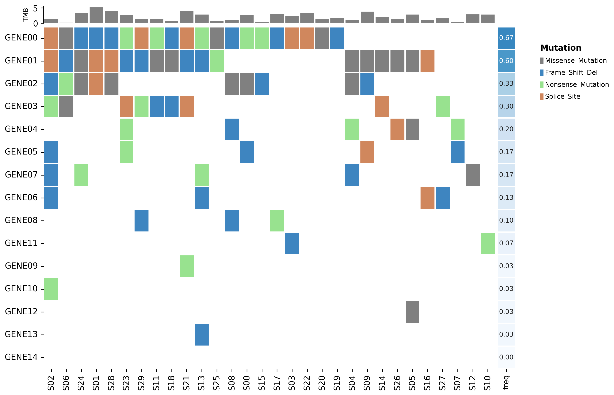
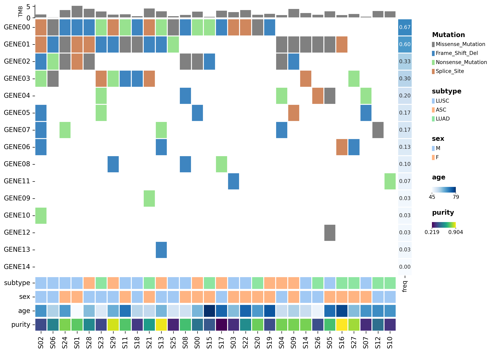
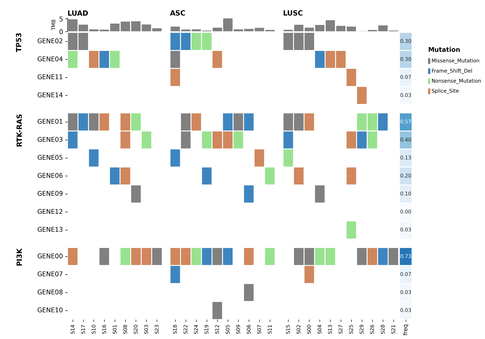
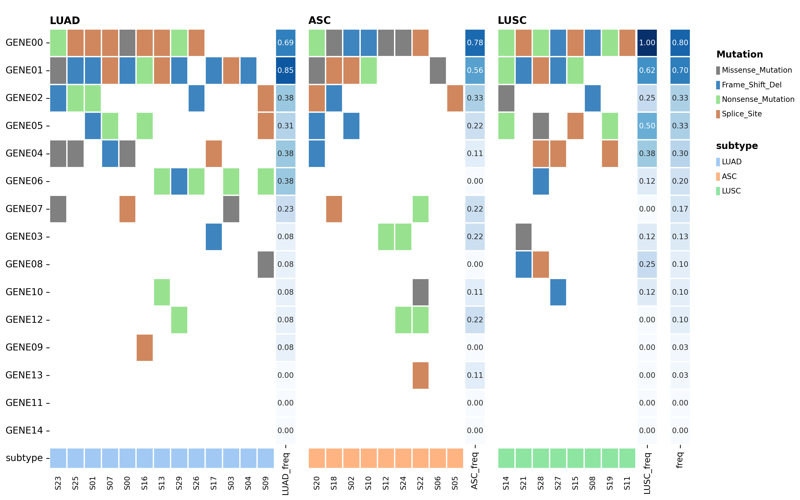
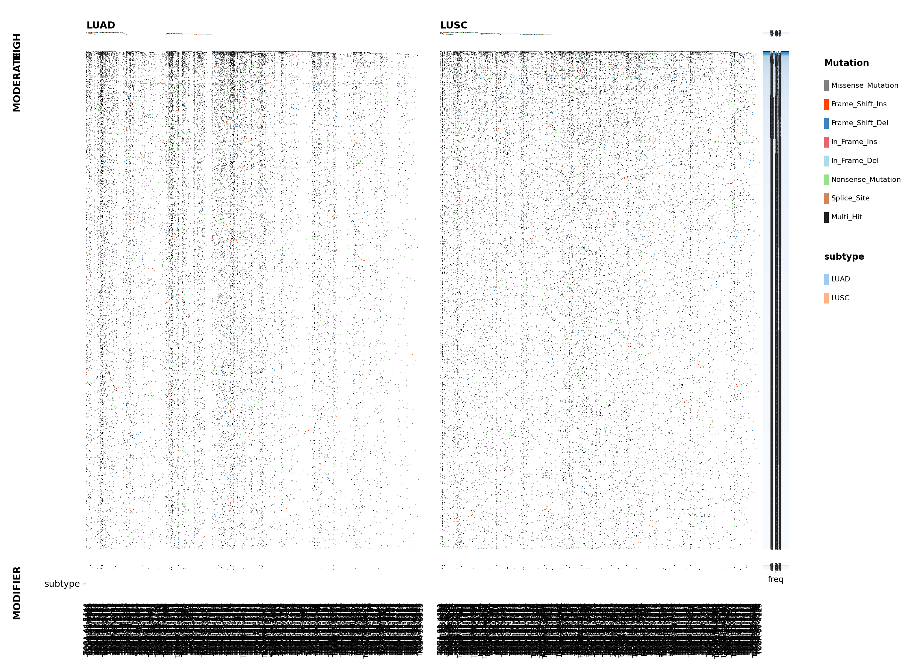
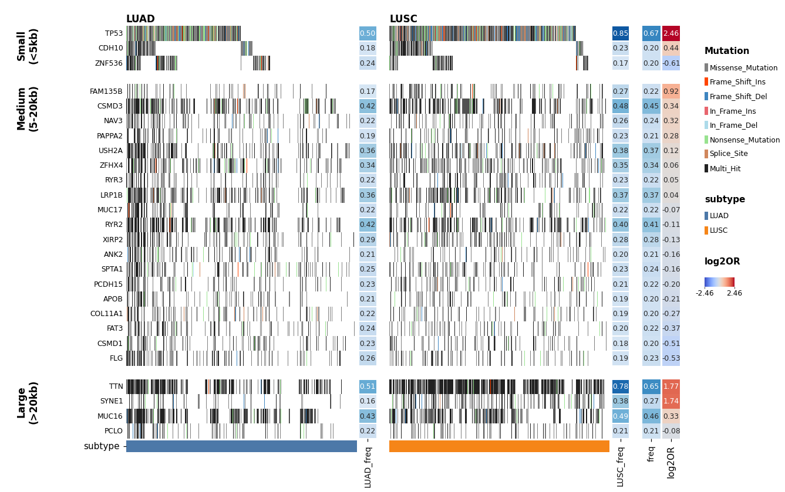

OncoPlot
========

An ``OncoPlot`` is built from **tracks**: one main mutation matrix plus any
number of side tracks (frequency strips, bar charts, metadata annotations) on
the top / bottom / left / right. You register tracks with chained ``add_*``
calls and draw the whole figure with a single ``render()``.

.. code-block:: text

                 ┌─────────────┐
        top  →   │   add_bar   │   (e.g. TMB)
                 ├─────────────┤
   left ┐        │             │  ┌ right
   add_ │  →     │    main()   │  │ add_freq / add_feature_annotation
   feat ┘        │   (matrix)  │  ┘
                 ├─────────────┤
     bottom →    │ add_sample_annotation │  (e.g. subtype)
                 └─────────────┘

Every example below follows the same shape::

    table.plot.oncoplot(figsize=...).main()....add_*()....render()

Start simple
------------

The smallest useful oncoplot is the mutation matrix with a frequency strip and a
TMB bar. This runs as-is on the bundled example MAF:

.. code-block:: python

   from pymaftools import load_example_maf

   maf = load_example_maf("multisample")

   table = (
       maf.to_gene_table()
       .add_freq()
       .calculate_tmb(default_capture_size=40)
       .sort_features(by="freq", ascending=False)
       .sort_samples_by_mutations()
   )

   op = (
       table.plot.oncoplot(figsize=(12, 8))
       .main()                    # the mutation matrix
       .add_bar("TMB", side="top")
       .add_freq(side="right")    # feature_metadata["freq"] as a strip
       .render()
   )
   op.save("oncoplot.png", dpi=300)

.. note::

   ``main()`` registers the matrix but draws nothing on its own — ``render()`` is
   what lays out and paints every registered track. Call ``render()`` exactly
   once, last.

Add metadata strips
-------------------

``add_sample_annotation`` draws ``sample_metadata`` columns as strips under (or
over) the matrix; ``add_feature_annotation`` does the same for
``feature_metadata`` on the row axis. Numeric columns become a colour-mapped
track with a colorbar, categorical columns a discrete colour strip.

.. code-block:: python

   op = (
       table.plot.oncoplot(figsize=(13, 9))
       .main()
       .add_bar("TMB", side="top")
       .add_freq(side="right")
       .add_feature_annotation(["pathway"], side="right")          # row strip
       .add_sample_annotation(["subtype", "sex"], side="bottom")   # categorical
       .add_sample_annotation(["age"], side="bottom")              # numeric
       .render()
   )

.. note::

   The bundled example MAF has no ``pathway`` / ``subtype`` / ``age`` columns —
   this figure comes from a small **synthetic** cohort. The complete runnable
   source (and the other synthetic figures on this page) is
   ``scripts/demo_oncoplot.py``::

       uv run python scripts/demo_oncoplot.py

.. tip::

   Use ``add_freq`` only for 0–1 frequency proportions (shared 0–1 scale). For a
   *signed* per-feature column (e.g. a ``delta_freq`` or ``log2OR``), use
   ``add_feature_annotation`` with a diverging cmap so the scale centres on 0::

       .add_feature_annotation(["log2OR"], side="right",
                               cmap_dict={"log2OR": "coolwarm"}, annotate=True)

Group rows and columns
----------------------

For a comparative oncoplot, section the rows by a ``feature_metadata`` category
and the columns by a ``sample_metadata`` category. Sort by the grouping key
first so each group is contiguous, then call ``group_features`` /
``group_samples``:

.. note::

   Like the metadata example above, this uses the synthetic ``pathway`` /
   ``subtype`` columns — they are **not** in the bundled MAF. Run it from
   ``scripts/demo_oncoplot.py``, or for a real-data grouped oncoplot on the
   bundled HDF5 fixture (which *does* have ``subtype``) see the capstone below.

.. code-block:: python

   grouped = (
       table.add_freq()
       .sort_features(by="pathway")                       # rows contiguous by group
       .sort_samples_by_group(group_col="subtype",
                              group_order=["LUAD", "ASC", "LUSC"], top=10)
   )

   op = (
       grouped.plot.oncoplot(figsize=(13, 9))
       .main()
       .add_bar("TMB", side="top")
       .add_freq(side="right")
       .group_features(by="pathway")     # row sections + rotated titles
       .group_samples(by="subtype")      # column sections + titles
       .render()
   )

Pass ``freq=True`` to ``group_samples`` to give each column section its **own**
frequency strip (``LUAD_freq`` next to the LUAD block, ...), populated by
``add_freq(group_col=...)`` or ``add_freq(groups=...)``:

.. code-block:: python

   .group_samples(by="subtype", freq=True)

Putting it together: a real cohort
-----------------------------------

Real cohorts are bigger and messier. Plotting **everything** naively — every
gene, every sample, labels forced on — is a useful anti-example:

Three things blow up at this scale:

- **too many genes** — rows blur into noise; nothing stands out
- **sample labels overflow** — ~1000 column names collapse into an illegible
  black band along the bottom
- **the frequency strips are unreadable** — squeezed too thin to annotate

.. note::

   This figure is the *full* gene table (thousands of genes × 958 samples), shown
   only to illustrate the failure mode. The bundled fixture below is already
   distilled to the 62 recurrently-mutated genes, so the runnable code starts one
   step ahead.

The fixes are exactly the tools from the earlier sections: **filter** to the
recurrent genes, give the rows **meaningful groups** (here, exon-size bands), and
let ``render()`` **auto-hide** the per-sample labels once there are too many to
read. The refined capstone bins genes by **exon size** into row sections, splits
columns by subtype with per-section frequency strips, adds an overall frequency
bar, and a diverging ``log2OR`` strip ranking genes by LUAD-vs-LUSC enrichment.
Grouping by size separates the huge "mutated-because-they're-long" passenger
genes (TTN, MUC16, SYNE1) from compact recurrent drivers (TP53).

.. code-block:: python

   from pathlib import Path

   import numpy as np
   import pandas as pd
   import pymaftools
   from pymaftools import read_h5

   # Resolve the bundled fixture from the installed package, so this works from
   # any working directory (a bare "pymaftools/data/..." only resolves at the
   # repo root).
   data_dir = Path(pymaftools.__file__).parent / "data"
   table = read_h5(data_dir / "example_tcga_lung_mutation_grouped.h5")

   # keep recurrently-mutated genes, look up exon size, bin into bands
   genes = table.feature_metadata.index[table.feature_metadata["freq"] >= 0.2]
   sub = table.subset(features=genes.tolist()).add_exon_size()
   sub.feature_metadata["size_group"] = pd.cut(
       sub.feature_metadata["exon_size"],
       bins=[0, 5000, 20000, 1e12],
       labels=["Small\n(<5kb)", "Medium\n(5-20kb)", "Large\n(>20kb)"],
   )

   # rank genes within each band by LUSC-vs-LUAD enrichment (Fisher log2 OR)
   enr = sub.mutation_enrichment_test(
       group_col="subtype", group1="LUAD", group2="LUSC", method="fisher"
   )
   c = enr[["LUAD_True", "LUAD_False", "LUSC_True", "LUSC_False"]].astype(float)
   luad_odds = (c["LUAD_True"] + 0.5) / (c["LUAD_False"] + 0.5)   # Haldane-corrected
   lusc_odds = (c["LUSC_True"] + 0.5) / (c["LUSC_False"] + 0.5)
   sub.feature_metadata["log2OR"] = np.log2(lusc_odds / luad_odds).reindex(
       sub.feature_metadata.index
   )

   # bands contiguous; within each, LUSC-enriched on top
   sub = sub.sort_features(by=["size_group", "log2OR"], ascending=[True, False])
   n_small = int((sub.feature_metadata["size_group"] == "Small\n(<5kb)").sum())
   sub = sub.sort_samples_by_group(
       group_col="subtype", group_order=["LUAD", "LUSC"], top=n_small
   )

   op = (
       sub.plot.oncoplot(figsize=(15, 9))
       .main(yticklabels=True, linewidths=0)
       .add_freq(side="right", freq_columns=["freq"], annot=True, linewidths=0)
       .add_feature_annotation(["log2OR"], side="right",
                               cmap_dict={"log2OR": "coolwarm"},
                               annotate=True, annotation_font_size=8, linewidths=0)
       .add_sample_annotation(["subtype"], side="bottom",
                              cmap_dict={"subtype": {"LUAD": "#4C78A8",
                                                     "LUSC": "#F58518"}},
                              linewidths=0, size=0.6)
       .group_features(by="size_group")
       .group_samples(by="subtype", freq=True, freq_annot=True)
       .render(wspace=0.03, hspace=0.03)   # sample labels auto-off (958 samples)
   )
   op.save("oncoplot_exon_size.png", dpi=110)

.. note::

   With ~1000 samples the per-sample column labels are unreadable, so
   ``render()`` hides them automatically. The full runnable source is
   ``scripts/demo_exon_size_grouping.py`` (it runs offline — gene sizes are
   bundled). See :doc:`pivottable` for ``add_exon_size`` / ``add_freq`` details.

For full method signatures and every track option, see the
:doc:`API Reference <api/plot>`.
